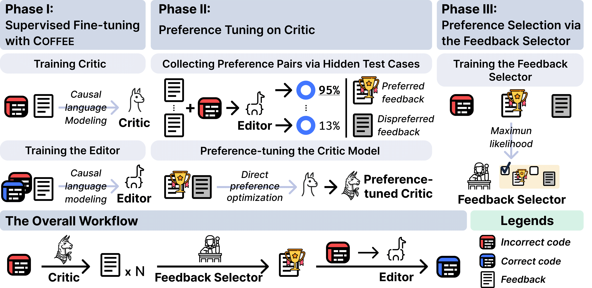

# COFFEE: Boost Your CodeLLMs by Fixing Bugs with Feedback
the official repository for the paper "COFFEE: Boost Your CodeLLMs by Fixing Bugs with Feedback".

Overview of framework, COFFEEPOTs (COde Fixing with FEEdback via Preference-Optimized Tuning and Selection)

  

